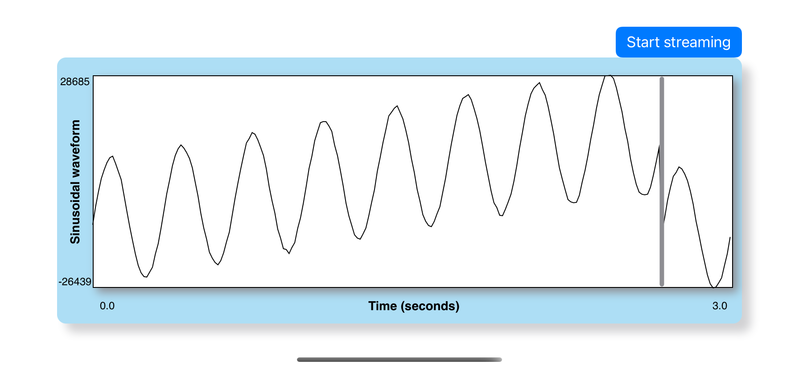

# WaveformPlotterExample

Example application to showcase the features available in 
"[swift-waveform_plotter](https://github.com/maurovm/swift-waveform_plotter)", 
a library to plot physiological time-series such as the Photoplethysmogram (PPG)
recorded from a pulse oximeter

WaveformPlotterExample is free software: you can redistribute it or modify it
under the terms of the GNU General Public License as published by the Free 
Software Foundation, version 2 only. Please check the file [COPYING](COPYING) 
for more information on the license and copyright.

If you use this app in your projects and publish the results, please cite the 
following manuscript:

> Villarroel, M. and Davidson, S. "Open-source software mobile platform for
physiological data acquisition". arXiv (In preparation). 2022

---

WaveformPlotterExample is an iOS application written in Swift. This repository 
only has the a minimum set of UI classes and configuration settings (XCode 
files, Settings.bundle, etc) to launch the plotting interface. The main 
functionality is provided by the following Swift Packages:

- [swift-waveform_plotter](https://github.com/maurovm/swift-waveform_plotter):
A library to plot physiological time-series such as the Photoplethysmogram (PPG).

Examples of other applications making use of the above Swift Packages are:

- [swift-thermal_recorder](https://github.com/maurovm/swift-thermal_recorder): 
Record video from thermal cameras such as the FLIR One.
- [swift-pulse_ox_recorder](https://github.com/maurovm/swift-pulse_ox_recorder): 
The main application (XCode, Settings.bundle, etc) to record time-series data 
from devices that support Bluetooth Low Energy (BLE) protocol.
- [swift-sensor_recording_utils](https://github.com/maurovm/swift-sensor_recording_utils): 
A module containing shared utility methods and classes used by other modules 
and applications to record raw data from sensors. 
- [swift-async_bluetooth](https://github.com/maurovm/swift-async_bluetooth): A 
Swift Package that replicates some of the functionality provided by Apple's 
CoreBluetooth module, but using Swift's latest async/await concurrency features.
- [swift-async_pulse_ox](https://github.com/maurovm/swift-async_pulse_ox): The 
main module that has all the functionality to connect and record data from 
devices that support Bluetooth Low Energy (BLE) protocol, such as heart rate 
monitors and pulse oximeters. 

## Plotting Examples

The image below shows an example of plotting a sinusoidal waveform using the 
synthetic waveform generator found in the [swift-waveform_plotter](https://github.com/maurovm/swift-waveform_plotter)
Swift Package:

    <kbd></kbd>

The image below is an example of the plotting the Photoplethysmogram (PPG)
signal recorded from a pulse oximeter from the
[swift-pulse_ox_recorder](https://github.com/maurovm/swift-pulse_ox_recorder)
application:

    <kbd></kbd>

